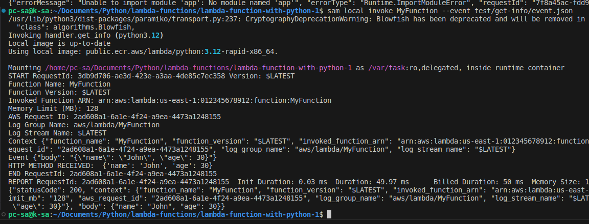

# First project with lambda

## I. Init project lambda function python3

```cmd
serverless create --template aws-python3 --path <name-project>
```
## II. How to test local lambda function
### 1. Install AWS SAM CLI:

Make sure you have Python installed on your system.

Install AWS SAM CLI using pip, the Python package manager. You can do this by running the following command:
```cmd
pip install aws-sam-cli
```
Alternatively, you can follow the installation instructions provided in the AWS SAM CLI documentation: Installing the AWS SAM CLI

### 2. Create event data to push to function
Create file event.json in path test/get-info/event.json 
This is the body to invoke function get-info

### 3. Invoke function local
```cmd
sam local invoke MyFunction --event test/get-info/event.json
```
This is result for above that:



## III. Deploy to lambda function aws 

Execute this command to deploy funciton

```cmd
sls deploy --verbose --stage <dev, uat, pro>
```
***Require OS***
```
- Python 3 
- Docker (sudo chmod 777 /var/run/docker.sock to grant permission)
- AWS CLI
```


***Request (Postman)***
```curl
curl --location 'https://zxpn9ylcel.execute-api.us-east-1.amazonaws.com/get-info' \
--header 'Content-Type: application/json' \
--data '{
    "requestId": "{{requestId}}",
    "requestTime": "{{requestTime}}",
    "signature": "{{signature}}",
    "data": {
        "fullName": "Nguyen Hoang Khang", 
        "dob": "22/02/2001"
    }
}'
```

***Pre-request Script (Postman)***
```curl
let uuid = require("uuid")
var CryptoJS = require("crypto-js")
const requestId = uuid.v4()

pm.environment.set("requestId", requestId);
pm.environment.set("requestTime", new Date().toISOString())
pm.environment.set("signature", (requestId + new Date().toISOString()))
```